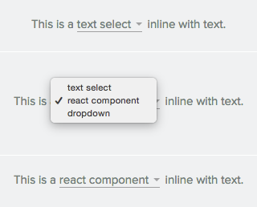

# React Blur

React component for creating blurred backgrounds.

[Live demo](http://javierbyte.github.io/react-blur/)

## Installation

    npm install react-blur --save

## Usage

    var Blur = require('react-blur');

    <Blur img='/directory/img.jpg' blurRadius={5}>
        The content.
    </Blur>

#### Props.

* img: The image path.
* blurRadius: The size of the blur radius.

Thanks to [Quasimodo](http://www.quasimondo.com/StackBlurForCanvas/StackBlurDemo.html) for the algorithm.