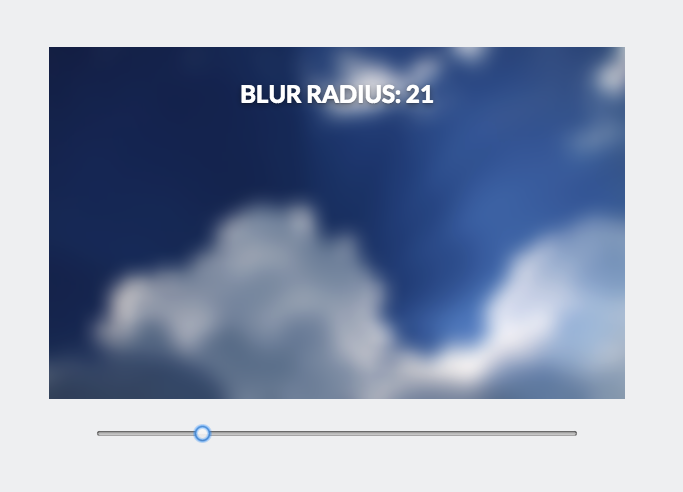

# [React Blur](http://javierbyte.github.io/react-blur/)
[](https://github.com/prettier/prettier)

React component for creating blurred backgrounds using canvas.

[Live demo](http://javierbyte.github.io/react-blur/)

[](http://javierbyte.github.io/react-blur/)

## Installation

```js
npm install react-blur --save
```

## Usage

```js
var Blur = require('react-blur');
```

### Example

```jsx
<Blur img='/directory/img.jpg' blurRadius={5} enableStyles>
  The content.
</Blur>
```

For a complete example see the code in the [demo branch](https://github.com/javierbyte/react-blur/blob/gh-pages/src/js/app.jsx).

#### Props

* `img`: The image path.
* `blurRadius`: Optional. The size of the blur radius.
* `enableStyles`: Optional. Flag to include base styles inline, omit this to easily override.
* `resizeInterval`: Optional. How fast the canvas should re-render on resize? Defaults to 128ms.

### Contributing

Please install [yarn](https://yarnpkg.com/en/) and use it to manage dependencies and the lockfile.

*Thanks to [Quasimodo](http://www.quasimondo.com/StackBlurForCanvas/StackBlurDemo.html) for the original stack blur algorithm.*
