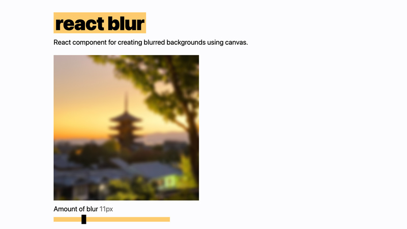

# [React Blur](https://javier.xyz/react-blur/)

React component for creating blurred backgrounds using canvas.

[](https://javier.xyz/react-blur/)

## Getting Started

If you're new to React, follow these steps to set up a React project and use `react-blur`:

1. **Install Node.js and npm**: Make sure you have Node.js and npm installed on your machine. You can download them from [nodejs.org](https://nodejs.org/).

2. **Create a New React Project**:
   Run the following command to create a new React project using Create React App:

   ```bash
   npx create-react-app my-blur-app
   cd my-blur-app
   ```

3. **Install `react-blur`**:
   Install the `react-blur` package using npm:

   ```bash
   npm install react-blur --save
   ```

4. **Start the Development Server**:
   Run the development server to see your React app in action:

   ```bash
   npm start
   ```

5. **Using `react-blur` in Your Project**:
   Now that your React project is set up, you can start using `react-blur` as described in the [Usage](#usage) section.

## Usage

```js
import Blur from "react-blur";
```

### Example

```jsx
<Blur img="/directory/img.jpg" blurRadius={5} enableStyles>
  The content.
</Blur>
```

For a complete example see the code in the [demo branch](https://github.com/javierbyte/react-blur/blob/gh-pages/src/js/app.jsx).

## Tutorial: Adding a Blurred Background to Your React App

Follow this tutorial to add a blurred background to your React app using `react-blur`.

1. **Import `react-blur`**:
   In your `src/App.js` file, import the `Blur` component:

   ```jsx
   import React from 'react';
   import Blur from 'react-blur';
   ```

2. **Add an Image**:
   Place an image in your `public` folder (e.g., `public/background.jpg`). This will be the image used for the blurred background.

3. **Create a Blurred Background**:
   Replace the content of your `App` component with the following code:

   ```jsx
   function App() {
     return (
       <Blur img="/background.jpg" blurRadius={10} enableStyles>
         <div style={{ padding: '20px', color: 'white' }}>
           <h1>Welcome to My App</h1>
           <p>This is a simple example of using `react-blur` to create a blurred background.</p>
         </div>
       </Blur>
     );
   }

   export default App;
   ```

4. **Run Your App**:
   Save the file and run your app using `npm start`. You should see a blurred background with text on top.

5. **Customize the Blur**:
   You can adjust the `blurRadius` prop to control the intensity of the blur. Try changing it to see the effect!

#### Props

- `img`: The image path.
- `blurRadius`: Optional. The size of the blur radius.
- `enableStyles`: Optional. Flag to include base styles inline, omit this to easily override.
- `shouldResize`: Optional. If the canvas should re-render on resize? Defaults to true.
- `resizeInterval`: Optional. How fast the canvas should re-render on resize? Defaults to 128ms.

## Troubleshooting

### 1. **Image Not Loading**
- Make sure the image path is correct and the image is placed in the `public` folder.
- If the image is hosted externally, ensure the URL is correct and accessible.

### 2. **Blur Effect Not Working**
- Check that the `blurRadius` prop is set to a value greater than 0.
- Ensure that the `enableStyles` prop is set to `true` if you want the default styles to be applied.

### 3. **Canvas Not Resizing**
- If the canvas does not resize correctly, make sure the `shouldResize` prop is set to `true` (default).
- You can also adjust the `resizeInterval` prop to control how often the canvas re-renders on resize.

### Contributing

_Thanks to [Quasimodo](http://www.quasimondo.com/StackBlurForCanvas/StackBlurDemo.html) for the original stack blur algorithm._
