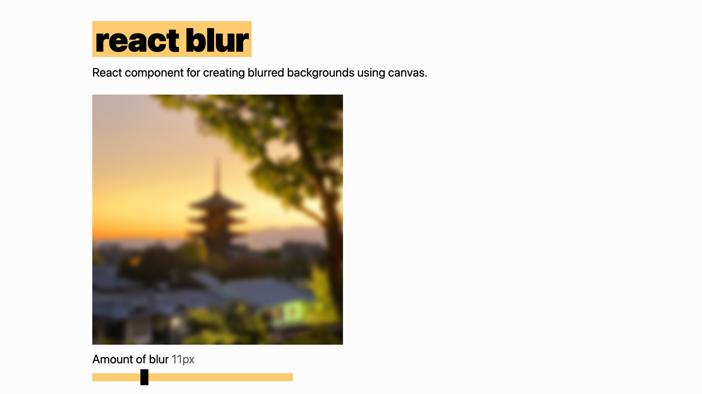

# [React Blur](https://javier.xyz/react-blur/)

React component for creating blurred backgrounds using canvas.

[](https://javier.xyz/react-blur/)

## Installation

```js
npm install react-blur --save
```

## Usage

```js
import Blur from "react-blur";
```

### Example

```jsx
<Blur img="/directory/img.jpg" blurRadius={5} enableStyles>
  The content.
</Blur>
```

For a complete example see the code in the [demo branch](https://github.com/javierbyte/react-blur/blob/gh-pages/src/js/app.jsx).

#### Props

- `img`: The image path.
- `blurRadius`: Optional. The size of the blur radius.
- `enableStyles`: Optional. Flag to include base styles inline, omit this to easily override.
- `shouldResize`: Optional. If the canvas should re-render on resize? Defaults to true.
- `resizeInterval`: Optional. How fast the canvas should re-render on resize? Defaults to 128ms.

### Contributing

_Thanks to [Quasimodo](http://www.quasimondo.com/StackBlurForCanvas/StackBlurDemo.html) for the original stack blur algorithm._
